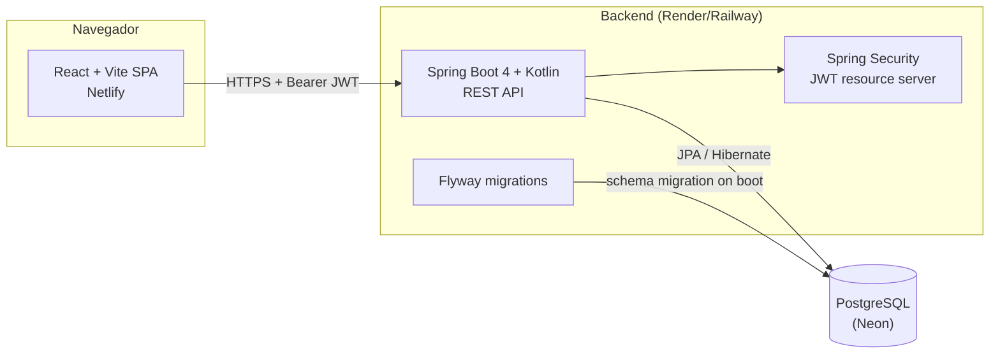
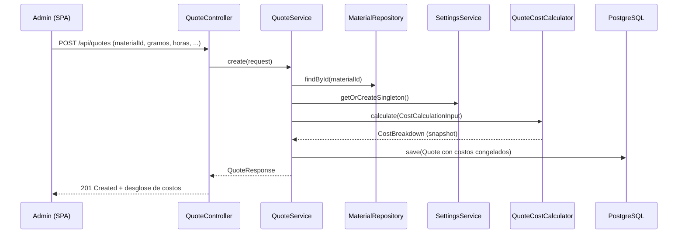

# Arquitectura — PrintCost Studio

## Componentes

## Flujo de datos: crear una cotización

Los costos se congelan en la fila de `quotes` en el momento de creación
(ver `docs/scope.md`): un cambio posterior en `Settings` o en el precio de un
`Material` nunca altera una cotización ya emitida.

## Autenticación

- Login (`POST /api/auth/login`) valida email/contraseña (BCrypt) contra la
  tabla `users` y emite dos JWT HS256: un access token de 15 min y un refresh
  token de 7 días (claim `typ` distingue ambos).
- Cada request protegido pasa por Spring Security's OAuth2 resource server
  (`NimbusJwtDecoder`), que valida firma, expiración y que `typ = access`.
- Autorización por rol: todo excepto `/actuator/health`,
  `/api/auth/login` y `/api/auth/refresh` exige `ROLE_ADMIN`. Es una herramienta
  de un solo operador: `ADMIN` es el único rol y no existe login de clientes.
  El login se mantiene porque protege los datos cuando la app está desplegada.

## Persistencia

- Las migraciones Flyway (`V1__init.sql` crea las tablas, `V2` quita el vínculo cliente→usuario); el
  esquema es la fuente de verdad tanto en Postgres (prod) como en H2 (perfil
  `local`), y Hibernate corre en modo `validate` en ambos casos — nunca
  genera DDL por su cuenta.
- Spring Boot 4 eliminó su autoconfiguración de Flyway; `DataSourceConfig`
  construye el `DataSource` y corre `Flyway.migrate()` sobre él antes de
  devolver el bean, así el orden de arranque queda garantizado sin wiring
  adicional (ver `docs/decisions.md`).

## Despliegue

| Componente | Proveedor | Notas |
|---|---|---|
| Frontend | Netlify (sitio nuevo) | `netlify.toml`: SPA fallback + cabeceras de seguridad |
| Backend | Render o Railway | Dockerfile en `backend/Dockerfile` |
| Base de datos | Neon (Postgres gestionado) | Backups automáticos del proveedor (ver README) |
